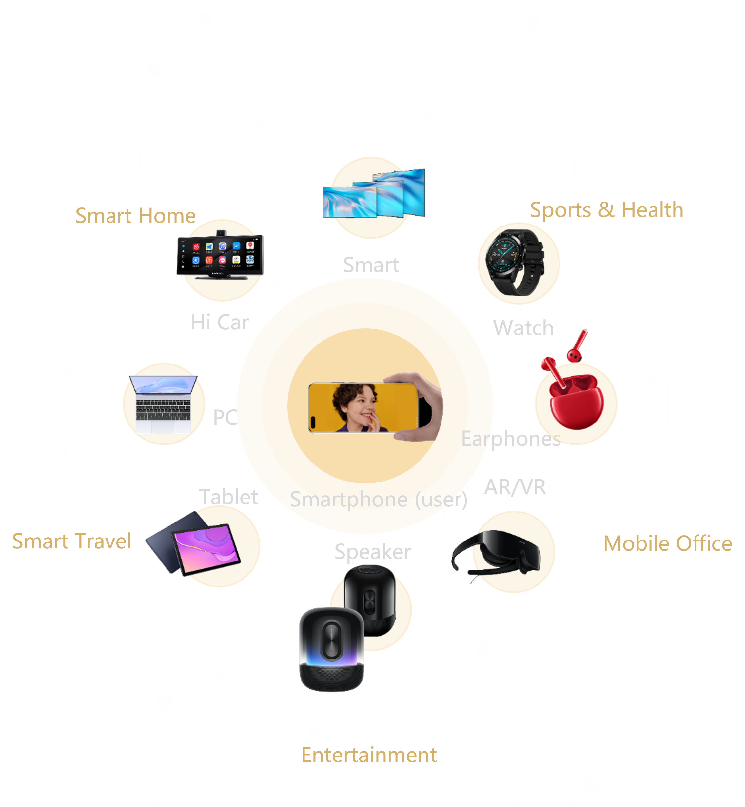

## Huawei Device Ecosystem
Huawei Device MAU (Phone + Tablets)
730M+ Global

1 + 8 + N
phone + devices + ecosystem
devices:
smartTV
Watch
earphone
AR/VR
speaker
Tablet 
PC
car

ADDITIONAL REVENUE STREAM
Continue to monetize on GMS phones (i.e. Huawei P30, P30 pro etc.), using your current set-up and monetization channels (AdMob, D&V360, others) and bring additional Revenue coming from a large user base of all the new Huawei smartphones model: from P40 to P50, Nova, etc., and all the future new lines of phones with HMS only.

HIGH FILL RATES & eCPMs
High internal advertising pressure to ensure high fill rate
First case studies of publishers who successfully integrated our SDK show an increase in the avg. CPM of +20%

FULL SUPPORT DURING AND AFTER INTEGRATION
Easy implementation of Ads Kit and mediation solution with full support from our technical team.
Responsive customer service and professional content review, for airtight quality controls and regulatory compliance.

## Introduction
Requirement
HMScore kit
HMSAds kit
AppsFlyer SDK
## HMS core
## Huawei Ads
## AppsFlyer
## Integration Process

## Using AppGallery Console
## Using Huawei Ads dashboard
## Using AppsFlyer dashboard
## Understanding AppsFlyer and Huawei Ads dashboard
## Making connection between Huawei ads and AppsFlyer dashboard
## Conclusion
## References
